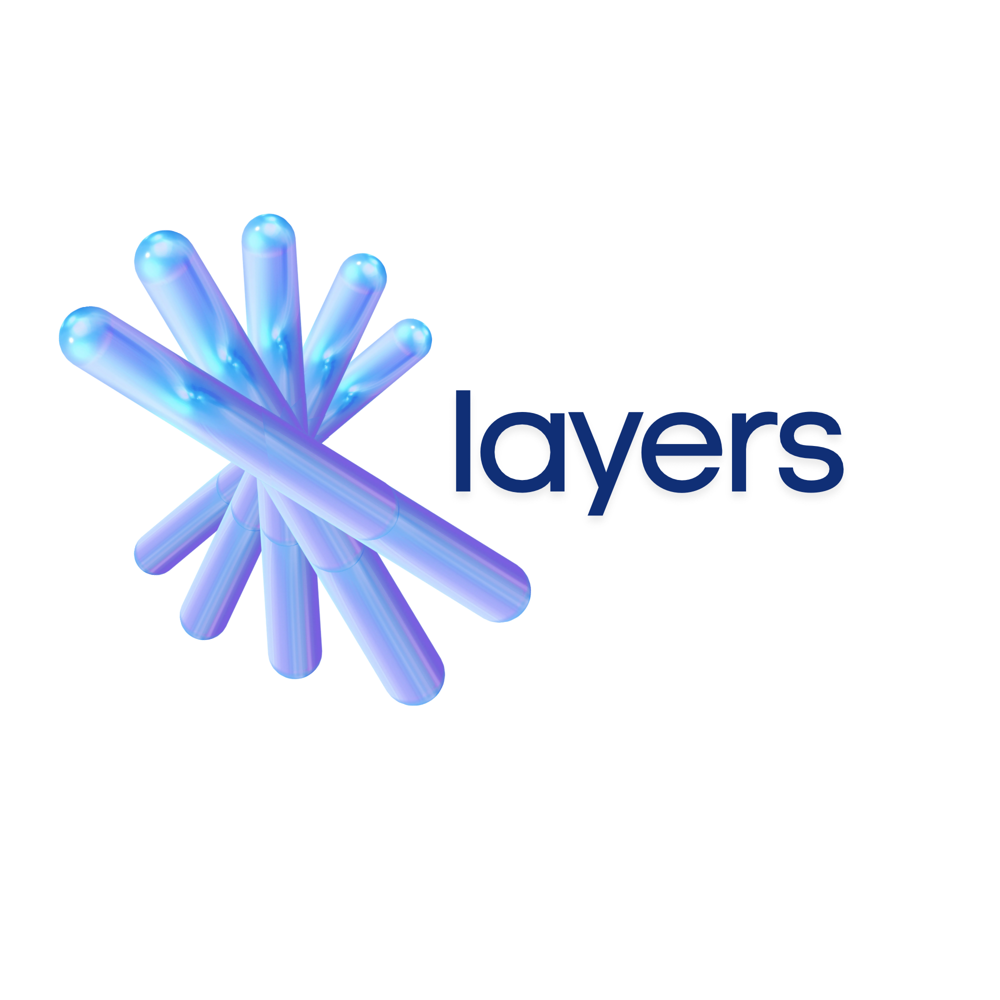

# HCKMX26-1776547739

<p align="center">
  
</p>

<p align="center"><em>"Aquí también te haces nombre."</em></p>

---

## Layers

**Layers** es un ecosistema de tres capas independientes pero interconectadas, diseñado para combatir el reclutamiento de adolescentes por parte del crimen organizado en México. Cada capa puede operar de forma autónoma, pero juntas se potencian: los datos de una alimentan la inteligencia de las otras.

### Las tres capas

1. **Jopi** — La aplicación móvil contra reclutamiento. Es la **estrella** del ecosistema y el corazón de la misión: una app educativa con tema espacial donde los adolescentes ganan identidad, dinero y pertenencia completando lecciones, ganando insignias, accediendo a mentores y graduándose con empleo real.

2. **KidsWatch** — Sistema de control parental e inteligencia de señales. Producto **independiente** orientado a B2C que detecta patrones de reclutamiento y contenido narco en el celular del menor mediante audio y OCR sobre capturas de pantalla. La lógica está completamente desarrollada y operativa; **la app móvil del menor aún no está construida** — el diagrama de arquitectura ya existe y la integración futura ya está contemplada.

3. **LayersIntel** — Plataforma de inteligencia de riesgo. Ingiere, valida, correlaciona y transforma señales multi-fuente (Layers Guard / KidsWatch, OSINT, datos institucionales) en inteligencia accionable en tiempo real, visualizada en un dashboard con CTI e inteligencia geoespacial.

### Arquitectura de tres capas

```
                    ┌──────────────────────────────┐
                    │       Jopi (móvil)            │
                    │   Núcleo: contra reclutamiento│
                    │   Misión social               │
                    └──────────────┬───────────────┘
                                   ▲
                                   │
                ┌──────────────────┴──────────────────┐
                │                                      │
   ┌────────────┴────────────┐         ┌──────────────┴──────────────┐
   │     KidsWatch           │         │      LayersIntel             │
   │  Control parental B2C   │         │  Plataforma de inteligencia  │
   │  Sostenibilidad         │         │  Escala e impacto            │
   └─────────────────────────┘         └─────────────────────────────┘

   Las tres capas son independientes. Cada una opera por sí sola.
   Conectadas, los datos de cada una enriquecen a las demás.
```

---

## Problema que resuelve

En México, el reclutamiento de adolescentes por parte del crimen organizado se ha convertido en un fenómeno sistemático. Los cárteles ofrecen lo que muchos otros actores no logran: **identidad, dinero inmediato, pertenencia, estatus y mentores presentes**. La mayoría de los programas de prevención compiten contra el dinero del cártel y pierden, porque atacan el síntoma (drogas, violencia) en lugar de la causa (la sensación de no importar).

**Jopi compite con el cártel en su propio terreno.** No enseña a decir "no". Ofrece algo mejor:

- **Identidad** — Insignias visibles y compartibles que dan estatus, no diplomas que dan vergüenza.
- **Dinero** — Pagos reales por cursos completados esta semana, no al graduarse en cinco años.
- **Pertenencia** — Mentores que sí aparecen, comunidad de exploradores y misiones grupales.
- **Alcance** — Influencers y mecánicas virales tipo TikTok, usadas en sentido contrario al reclutamiento.
- **Salida** — Graduación con empleo real, no con un certificado que no abre puertas.

A esto se suman las otras dos capas del ecosistema:

- **KidsWatch** detecta señales tempranas de reclutamiento en el celular del menor (intentos de captación vía WhatsApp, TikTok, Telegram) y alerta a los padres antes de que el contacto escale. Es un producto **independiente de Jopi**, pero su lógica de detección es 100% funcional y está lista para conectarse a la app del menor cuando se desarrolle.
- **LayersIntel** convierte las señales agregadas y anonimizadas en inteligencia geoespacial y CTI accionable para gobiernos, equipos de seguridad y organizaciones de Trust & Safety.

> *La mayoría de los programas de prevención compiten con el dinero del cártel. Layers compite con algo más profundo: la sensación de importar.*

---

## Tecnologías y herramientas utilizadas

### Jopi (capa móvil — la estrella)
- **Frontend:** SwiftUI (iOS 17+ / macOS 14+), Swift 5.9+
- **Plataforma:** Xcode 15.0+
- **Distribución:** cuenta de desarrollador Apple
- **Sin dependencias externas:** SwiftUI nativo
- **Sistema de diseño propio:** colores, tipografía y componentes en `DesignSystem/`
- **Recursos:** lecciones en JSON, gestores de notificaciones, TTS y feedback háptico
- **Backend:** API REST (consumo desde la app)

### KidsWatch (capa de control parental — lógica funcional, app pendiente)
- **Backend:** Python 3 + Flask (API `/analizar`)
- **OCR:** Tesseract 5.3.4 con paquete de español, pipeline multi-pass (7 variantes × 3 modos PSM = 21 pasadas por imagen)
- **Fuzzy matching:** `rapidfuzz` (umbral 85% de similitud) para tolerancia a errores típicos de OCR
- **Infraestructura AWS:** dos instancias EC2 en `us-east-1` (una para backend Flask + OCR, otra para servidor web Next.js)
- **Sistema operativo:** Ubuntu 24.04 LTS / Amazon Linux 2023
- **Reverse proxy:** nginx 1.28.3 con SSL (Let's Encrypt + Certbot, renovación automática)
- **CDN / SSL:** Cloudflare (proxy y SSL termination)
- **Email:** Gmail SMTP (`smtp.gmail.com:587`, STARTTLS) — entrega confirmada
- **Servicio:** systemd autostart
- **Dominio:** `core.layersintel.com` operativo
- **App móvil del menor:** **pendiente de construcción** — diagrama y contrato de API ya definidos (planeada en MIT App Inventor con SpeechRecognizer, Camera, Web, Clock y Notifier)

### LayersIntel (capa de inteligencia y dashboard)
- **Frontend + API:** Next.js 14.2.5 con TypeScript
- **Estilos:** Tailwind CSS
- **Base de datos:** Supabase (PostgreSQL + PostGIS para geoespacial)
- **Visualización geoespacial:** Leaflet
- **Analítica y gráficas:** Recharts
- **Despliegue:** EC2 `ec2-kidswatch-web` bajo dominio `layersintel.com` y `core.layersintel.com`

---

## Instrucciones para ejecutar el prototipo

### Jopi (app móvil)

```bash
git clone https://github.com/tu-usuario/jopi.git
cd jopi
```

1. Abrir `jopi.xcodeproj` en Xcode 15.0 o superior.
2. No requiere instalación de dependencias externas (SwiftUI nativo).
3. Seleccionar un simulador o dispositivo físico.
4. Compilar y ejecutar con `Cmd + R`.

Flujo de uso: registro/inicio de sesión → onboarding → exploración de cursos → completar lecciones → ganar XP y chispas → personalizar avatar → unirse a la comunidad.

### KidsWatch (backend de control parental — lógica funcional)

El backend ya está desplegado y operativo en `https://core.layersintel.com`. Para validar la detección:

```bash
# Alerta crítica — patrón de reclutamiento
curl -X POST https://core.layersintel.com/analizar \
  -H "Content-Type: application/json" \
  -d '{"fuente":"audio","texto":"reclutar gente para convoy con fierro traslado urgente manda inbox","timestamp":"2026-04-25T10:00:00"}'

# Alerta sobre imagen (OCR)
curl -X POST https://core.layersintel.com/analizar \
  -F "fuente=foto" \
  -F "imagen=@/ruta/a/captura.jpg" \
  -F "timestamp=2026-04-25T10:00:00"
```

Para validar el pipeline OCR localmente sobre imágenes de muestra:

```bash
cd server
python3 train.py            # procesa todas las imágenes de ../imagenes/
python3 train.py --verbose  # ver texto OCR completo extraído
```

> **Nota importante:** la app móvil del menor (cliente Android que captura audio y screenshots) **aún no está desarrollada**. El diagrama de arquitectura, los componentes y los bloques de MIT App Inventor ya están definidos en la documentación interna; el backend está 100% listo para recibir sus peticiones cuando se construya. KidsWatch es un **producto independiente de Jopi** y se integrará a futuro como capa de señales del ecosistema.

### LayersIntel (dashboard)

```bash
cd layers-intel
npm install
npm run dev
```

La app Next.js corre en `http://localhost:3000`. En producción se sirve a través de nginx en `layersintel.com` y `core.layersintel.com`.

---

## Demo del prototipo

> _Pendiente de completar (enlace público al demo)._

---

## Documentación de herramientas de IA utilizadas

Toda la IA fue utilizada como **herramienta de apoyo y referencia**. Todos los datos, decisiones de producto y contenido entregable son reales, validados y producidos por el equipo. Las herramientas de IA aceleraron el desarrollo, no lo sustituyeron.

### Modelos y servicios utilizados

| Herramienta | Tipo | Uso en el proyecto | Medida de uso |
|---|---|---|---|
| **Claude Opus 4.7** | LLM (Anthropic) | Fuente principal de generación y revisión de código en las tres capas. Apoyo en arquitectura, decisiones de diseño, redacción de copy del pitch, slogans de Jopi e iteración sobre prompts del modelo de riesgo. | Alta — uso transversal en backend Flask, frontend Next.js y app SwiftUI |
| **Claude Code** | Asistente de programación (Anthropic) | Auxiliar para tareas de programación en terminal: refactors, debugging, edición multi-archivo, exploración de código existente y validación de pipeline OCR. | Media — apoyo puntual en sesiones de desarrollo intensivo |
| **Gemini 3** | Modelo multimodal (Google) | Generación de imágenes, prototipos visuales y exploración de variantes de logo para Jopi y Layers. | Baja-media — exclusivamente en la fase de diseño visual |
| **Tesseract OCR 5.3.4** | Modelo local de OCR | Extracción de texto en español sobre capturas de pantalla de TikTok/WhatsApp en KidsWatch. Pipeline multi-pass con 7 variantes de preprocesamiento × 3 modos PSM (21 pasadas por imagen) para superar texto blanco sobre fondos complejos. | Alta — núcleo del módulo de detección por imagen |
| **rapidfuzz** | Librería de fuzzy matching | Comparación tolerante a errores de OCR contra el diccionario de keywords del modelo de riesgo (umbral 85% de similitud). Captura variantes como `0portunidad` → `oportunidad`. | Alta — pieza clave del detector de KidsWatch |

### Principios de uso de IA en el proyecto

- **La IA es herramienta, no autor.** Toda decisión de producto, arquitectura y entregable fue tomada y validada por el equipo.
- **Los datos son reales.** Las imágenes de prueba, los resultados de detección, los scores y los emails entregados son todos verificables.
- **La IA acelera, no reemplaza.** Su rol fue reducir tiempo de iteración en tareas mecánicas (boilerplate, debugging, generación de variantes) y servir como caja de resonancia para decisiones de diseño.
- **Validación humana obligatoria.** En particular, LayersIntel opera bajo el principio de "decision-support intelligence": ninguna acción operativa se ejecuta sin validación humana.

---

## Integrantes del equipo

- **Carolina Nolasco** — Mecatrónica. Sistemas embebidos y captura en dispositivo.
- **Ruy Cabello** — Mecatrónica. Backend Python/FastAPI, Raspberry Pi, Linux e infraestructura.
- **Alejandro Grimaldo** — Software Developer. Cloud, orquestación del pipeline, front y backend.
- **David Farfán** — Ciberseguridad. Cifrado, modelo de amenazas y hardening.
- **Yahir Gaspar** — Ciberseguridad. Experiencia previa desarrollando soluciones similares.
